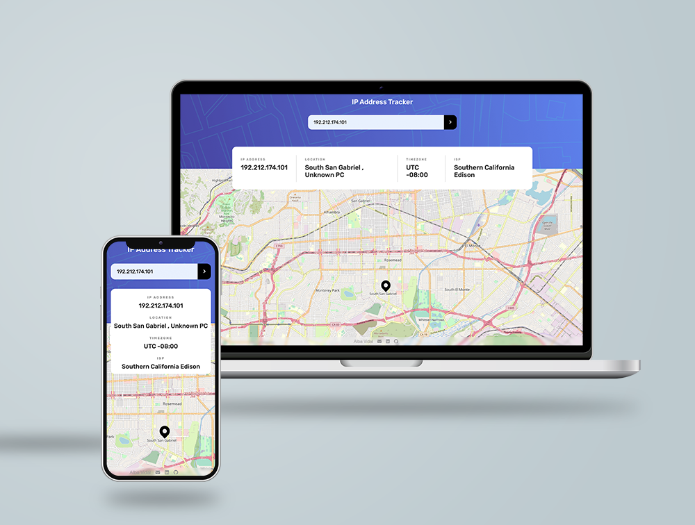

# 📡 IP Tracker

You will be able to see on a dynamic map the details of your local IP or one that you enter in the input as well as a domain name.<br>
The design should look as similar as possible to the design provided in jpg for mobile and desktop.

## Screenshots



<br>

---

<br>

## Table of contents

- [My process](#my-process)
  - [Why this project?](#why-this-project)
  - [Elements that I have to show and structure](#elements-that-i-have-to-show-and-structure)
  - [Built with](#built-with)
  - [API reference](#api-reference)
  - [What happens on the web?](#what-happens-on-the-web)
  - [Steps](#steps)
  - [What I learned](#what-i-learned)
- [Further implementations](#further-implementations)
- [Links](#links)
- [How can you run this project](#how-can-you-run-this-project)
- [Author](#author)
- [Support](#support)

<br>

---

<br>

## MY PROCESS

### Why this project?

After having been working on a big project like [Videogames-searcher](https://github.com/albavidalm/videogames-searcher) I wanted to make a smaller App to be able to:

- Work with several APIs at the same time like [ipAPI](https://ipapi.co/json/) and [IP Geolocation API](https://geo.ipify.org/) that interactue with the [leafleft](https://leafletjs.com/) library
- Use a map that can be located with latitude and longitude
- Organise in [Projects](https://github.com/users/albavidalm/projects/3/views/1)
- Develop a cool Readme
- Apply testing (in progress)

<br>

### Elements that I have to show and structure

#### Show

- Header
  - IP Address tracker
  - Input --> "Search for any IP address or domain"
  - Info box (returns API 1 from input or API 2 from IP user):
    - IP Address
    - Location
    - Time zone
    - ISP
- Map (returns API 1 or API 2 from its data)

<br>

#### Structure

```bash
.
├── LICENSE
├── README.md
├── docs
├── node_modules
├── package-lock.json
├── package.json
├── public
└── src
    ├── assets
    │   └── images
    │       └── designs
    ├── components
    │   ├── Footer.js
    │   ├── Header.js
    │   ├── InfoBox.js
    │   ├── IptrackerApp.js
    │   ├── Mapview.js
    │   ├── Markerposition.js
    │   ├── SearchInput.js
    │   └── services
    │        └── getApiData.js
    ├── index.js
    └── stylesheets
        ├── IptrackerApp.scss
        ├── components
        │   ├── _footer.scss
        │   ├── _header.scss
        │   ├── _infobox.scss
        │   ├── _leafleft.scss
        │   └── _mapview.scss
        ├── core
        │   ├── _mixins.scss
        │   ├── _reset.scss
        │   └── _variables.scss
        ├── index.css
        └── layout
            └── _body.scss
```

<br>

### Built with

- [VSC](https://code.visualstudio.com/)
- [npm](https://www.npmjs.com/) Version 6.14.12
- [HTML5](https://developer.mozilla.org/en-US/docs/Web/HTML)
- [CSS3](https://developer.mozilla.org/es/docs/Web/CSS)
- [Sass](https://sass-lang.com/) Version 1.57.1
- [Flexbox](https://developer.mozilla.org/es/docs/Web/CSS/CSS_Flexible_Box_Layout/Basic_Concepts_of_Flexbox)
- [React 18](https://es.reactjs.org/)
- API to get the IP Address locations: [IP Geolocation API by IPify](https://geo.ipify.org/)
- API to get the user IP: [ipapi](https://ipapi.co/)
- [LeafletJS](https://leafletjs.com/)
- [React Leaftlet](https://react-leaflet.js.org/) Version 4.2.0. Provides bindings between React and Leaflet
- [Jest](https://jestjs.io/es-ES/) Version 29.3.1

<br>

### API Reference

This project is created by working with the two APIs listed above.

#### API 1: [IP Geolocation API by IPify](https://geo.ipify.org/) to get the IP Address locations

You can find all the API information and documentation here: https://geo.ipify.org/docs

All API requests require the use of a generated API key, so to run the project you will need your own API key and you can generate this API key here: https://geo.ipify.org/signup

| Parameter | Type     | Description                |
| :-------- | :------- | :------------------------- |
| `key`     | `string` | **Required**. Your API key |

Due I needed the information of the Country and the city I worked with the next **endpoint**:

**"Country + City" API type features**

```http
  GET
https://geo.ipify.org/api/v2/country,city?apiKey=YOUR_API_KEY&ipAddress=8.8.8.8
```

**Responses**

```bash
{
    "ip": "8.8.8.8",
    "location": {
        "country": "US",
        "region": "California",
        "city": "Mountain View",
        "lat": 37.40599,
        "lng": -122.078514,
        "postalCode": "94043",
        "timezone": "-07:00",
        "geonameId": 5375481
    },
    "domains": [
        "0d2.net",
        "003725.com",
        "0f6.b0094c.cn",
        "007515.com",
        "0guhi.jocose.cn"
    ],
    "as": {
        "asn": 15169,
        "name": "Google LLC",
        "route": "8.8.8.0/24",
        "domain": "https://about.google/intl/en/",
        "type": "Content"
    },
    "isp": "Google LLC"
}
```

#### API 2: [ipapi](https://ipapi.co/) to get the user's IP

You can find all the API information and documentation here: https://ipapi.co/api/

In my case I have decided to use this API to just look for the user's IP and pass it to API 1 [IP Geolocation API by IPify](https://geo.ipify.org/) to return the data through it.

This endpoint returns the complete location of the client (device) that’s making the request.

```https
GET https://ipapi.co/{format}/
```

| Parameter | Description                                                                        |
| :-------- | :--------------------------------------------------------------------------------- |
| `format`  | Data format of response, possible values are `json`, `jsonp`, `xml`, `csv`, `yaml` |

For this project:

```http
https://ipapi.co/json/
```

**Response**

```bash
{
  "ip": "208.67.222.222",
  "city": "San Francisco",
  "region": "California",
  "region_code": "CA",
  "country": "US",
  "country_name": "United States",
  "continent_code": "NA",
  "in_eu": false,
  "postal": "94107",
  "latitude": 37.7697,
  "longitude": -122.3933,
  "timezone": "America/Los_Angeles",
  "utc_offset": "-0800",
  "country_calling_code": "+1",
  "currency": "USD",
  "languages": "en-US,es-US,haw,fr",
  "asn": "AS36692",
  "org": "OpenDNS, LLC"
}
```

<br>

### What happens on the web?

#### When the user enters the web the App looks for the local IP:

- By means of the hook useEffect I indicate that when the page is rendered for the first time it looks for if `localIp` state exists, which is where the user's local Ip would be stored.
- If localIp is defined, I call the function `getIp` that calls [ipAPI](https://ipapi.co/json/), save this value in a state and pass this data as parameter to the function `getApiData` which calls the API that obtains all the IP information, [IP Geolocation API](https://geo.ipify.org/).
- Once the information arrives update the state ipData by setIpData.
- With the local IP information I pass the latitude and longitude to the component Mapview that has the library [leafleft](https://leafletjs.com/) and the map below shows the IP physical location.

<br>

#### If the user enters a value in the input:

- When user press the Send button, the input value of the form is saved in the `inputValue` state and I call `getApiData` but passing it the input value.
- As in the step before, I pass the latitude and longitude to the component Mapview.

<br>

### Steps

1. How do APIs work?
2. How leaflet works?
3. Think about design starting at Mobile first
4. Create Header with the search engine input
5. Clean API data
6. Search for user's IP
7. Display cleanData by console.log
8. Once checked cleanData is correct launch getApiData at the very first of the App
9. Relate the value of the user's input to the API (getApiData)
10. If user submits an IP show the input value data
11. Create getApiMap
12. Show map
13. Create data box
14. Show cleanData in the box
15. Working with CSS (mobile first)
16. Clean code
17. Can I refactor?
18. Can I atomise?
19. Add testing

<br>

### What I learned

- Organizing a project from the beginning is very important, having written and structured the steps that I had to carry out has helped me to better manage time.
- Before you start writing code, research the steps you will have to take:
  - How do the APIs work?
  - How do I know the local IP?
- Using useEffect when necessary, if the submit button can call the getApi function I save the use of that hook.
- Leafleft was harder that I though but looking for information in addition to the documentation and understanding it was a success.

<br>

---

<br>

## Further implementations

- Apply testing
- Design a tablet layout
- Refactor
- Atomise

<br>

---

<br>

## Links

- Code: [https://github.dev/albavidalm/ip-address-tracker](https://github.dev/albavidalm/ip-address-tracker)
- Live: [https://albavidalm.github.io/ip-address-tracker](https://albavidalm.github.io/ip-address-tracker)

<br>

---

<br>

### How can you run this project

This project was bootstrapped with [Create React App](https://github.com/facebook/create-react-app).

- Once you've download or cloned the project, install it with:

  ```bash
  npm install
  ```

- After that, if you want to run it in local execute this command:
  ```bash
  npm start
  ```

<br>

---

<br>

## Author

[](mailto:albavidalm@gmail.com?subject=Hi)
[](https://www.linkedin.com/in/albavidalm//)
[](https://twitter.com/albavidal_m)
[](https://github.com/albavidalm)

<br>

---

<br>

## Support 🖤

Sharing is caring, contributions, PR and suggestions are always welcome.
